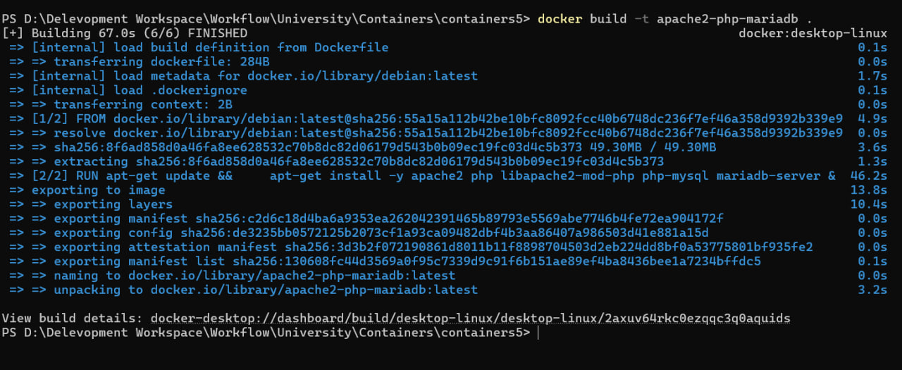
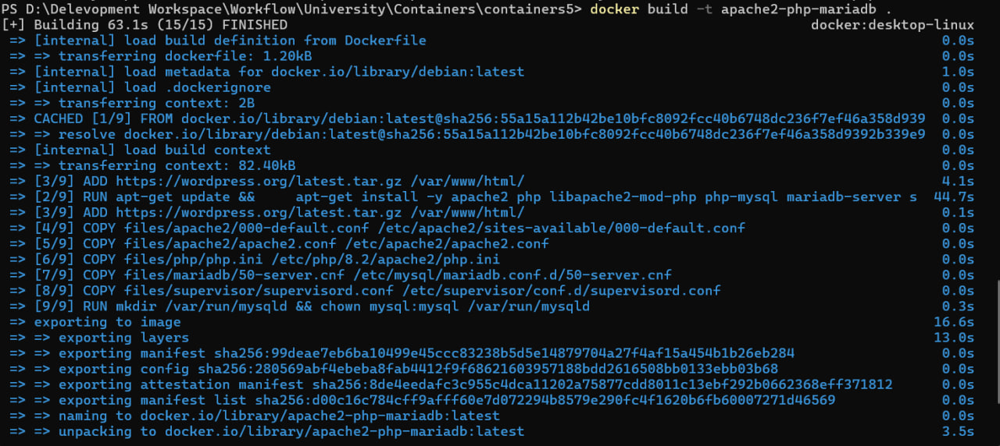
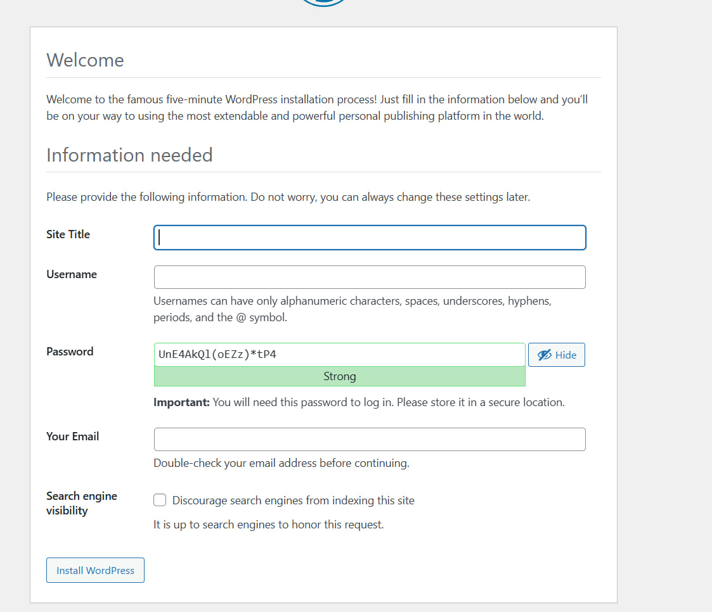
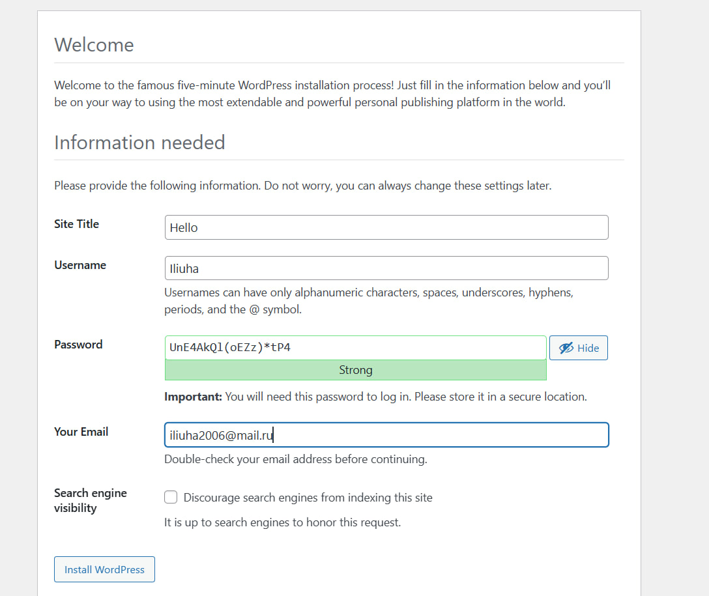
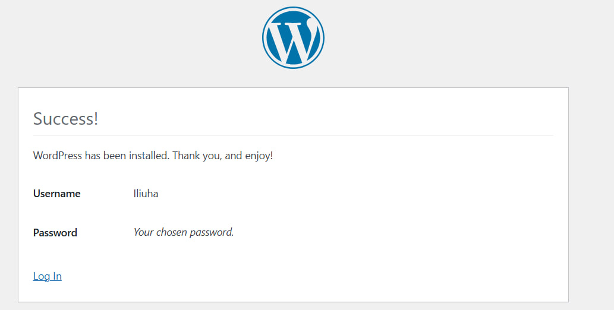

# Лабораторная работа №5: Запуск сайта в контейнере

## Цель работы

Научиться готовить образ Docker-контейнера для веб-сайта на стеке **Apache HTTP Server + PHP (mod_php) + MariaDB**, смонтировать том для данных БД, опубликовать сервис на нужном порту, установить **WordPress** и убедиться, что сайт работает.

## Задание

1. Создать `Dockerfile` для образа с Apache, PHP, MariaDB и WordPress.
2. Данные MariaDB хранить в **монтируемом томе** (`/var/lib/mysql`).
3. Веб-сервер должен быть доступен с хоста (в задании — **порт 8000**, маппинг `8000:80`).
4. Установить и проверить работу **WordPress**.
5. Оформить отчёт и выложить проект на **GitHub**.

---

## Описание выполнения работы

Иллюстрации шагов — скриншоты из каталога [`images/`](images/) (файлы `photo_*_2026-04-05_15-34-29.jpg`).

### 1. Репозиторий и структура `files/`

Создан репозиторий **containers05** (данный проект) со структурой:

- `files/apache2/` — конфигурация Apache2 (`000-default.conf`, `apache2.conf`);
- `files/php/` — `php.ini` для модуля Apache;
- `files/mariadb/` — `50-server.cnf`;
- `files/supervisor/` — `supervisord.conf`;
- `files/wp-config.php` — конфигурация WordPress.

Наличие каталогов с конфигурациями на диске (фрагмент):


### 2. Извлечение конфигов из временного контейнера

Собран базовый образ по методичке (`docker build -t apache2-php-mariadb .`):



Запущен временный контейнер с интерактивной оболочкой (`docker run ... bash`), как требует методичка:


Командами `docker cp` скопированы эталонные файлы из `/etc/apache2/`, `/etc/php/.../apache2/`, `/etc/mysql/mariadb.conf.d/`. Для PHP путь из методички (`/etc/php/8.2/...`) может не совпасть с версией в образе — на скриншоте видна ошибка и проверка `/etc/php/`, после чего `php.ini` скопирован из актуального каталога (в данном случае **8.4**):


Контейнер после копирования остановлен и удалён.

### 3. Настройка конфигурационных файлов

- **Apache (`files/apache2/000-default.conf`)**: задан `ServerAdmin`, после `DocumentRoot` добавлен `DirectoryIndex index.php index.html`, настроено имя сервера в соответствии с методичкой.
- **Apache (`files/apache2/apache2.conf`)**: в конец файла добавлена строка `ServerName localhost`.
- **PHP (`files/php/php.ini`)**: включён `error_log`, заданы `memory_limit`, `upload_max_filesize`, `post_max_size`, `max_execution_time`.
- **MariaDB (`files/mariadb/50-server.cnf`)**: раскомментирован `log_error` для журнала ошибок.

### 4. Supervisor

Создан `files/supervisor/supervisord.conf`: одновременно поднимаются **Apache** (`apache2ctl -D FOREGROUND`) и **MariaDB** (`mariadbd`), процессы перезапускаются при падении.

### 5. Dockerfile

- Образ: `debian:latest`.
- Объявлены тома: `/var/lib/mysql`, `/var/log`.
- Установлены: `apache2`, `php`, `libapache2-mod-php`, `php-mysql`, `mariadb-server`, `supervisor`.
- Скачан и распакован архив WordPress в `/var/www/html/`.
- Конфиги копируются в образ; PHP-конфиг — в путь вида `/etc/php/8.2/apache2/php.ini` (версия PHP зависит от образа Debian).
- Создана директория `/var/run/mysqld` с владельцем `mysql`.
- Открыт порт **80** (на хосте используется проброс, например **8000:80**).
- Точка входа: `supervisord` с конфигом в `/etc/supervisor/conf.d/supervisord.conf`.

Фрагмент итогового `Dockerfile` в редакторе:


Сборка:

```text
docker build -t apache2-php-mariadb .
```



Для проверки процессов внутри образа при отладке снова можно запустить контейнер с `bash` (на скриншоте без проброса порта — это не боевой режим сайта):


Запуск с томом для БД и портом 8000:

```text
docker run -d --name apache2-php-mariadb -p 8000:80 -v wp_mysql_data:/var/lib/mysql apache2-php-mariadb
```

### 6. База данных и пользователь WordPress

Внутри контейнера выполнено подключение к `mysql` и созданы база `wordpress`, пользователь `wordpress` с паролем `wordpress`, выданы права на базу (команды из методички: `CREATE DATABASE`, `CREATE USER`, `GRANT`, `FLUSH PRIVILEGES`).


При необходимости после пересоздания контейнера без тома пользователя и базу нужно создать заново; при использовании именованного тома данные сохраняются.

### 7. Конфигурация WordPress

Через веб-интерфейс указаны параметры БД (имя БД, пользователь, пароль, хост `localhost`, префикс `wp_`), сгенерирован или скопирован текст `wp-config.php` в `files/wp-config.php`, файл подключается в образ командой `COPY`.

Если появляется ошибка подключения к БД, имеет смысл проверить, что пользователь создан в текущем экземпляре MariaDB, и при проблемах с сокетом попробовать `DB_HOST` = `127.0.0.1`.

### 8. Проверка

В браузере: `http://localhost:8000/wordpress/` (или `http://localhost/wordpress/` при пробросе 80→80) — мастер установки WordPress, затем финальный экран и вход в админку.








### 9. Публикация на GitHub

Репозиторий инициализирован/связан с удалённым на GitHub; после коммита выполняется `git push` в свою ветку (например, `main`).

---

## Ответы на вопросы

### Какие файлы конфигурации были изменены?

| Файл | Назначение изменений |
|------|----------------------|
| `files/apache2/000-default.conf` | Виртуальный хост: `ServerAdmin`, `DirectoryIndex`, настройки корня сайта |
| `files/apache2/apache2.conf` | Глобально: `ServerName localhost` |
| `files/php/php.ini` | Лог ошибок PHP, лимиты памяти и загрузки, время выполнения |
| `files/mariadb/50-server.cnf` | Путь к логу ошибок сервера MariaDB |
| `files/supervisor/supervisord.conf` | Запуск Apache и MariaDB под supervisord |
| `files/wp-config.php` | Параметры подключения к БД, ключи безопасности, префикс таблиц |

Также по смыслу «изменён» **Dockerfile** (он описывает итоговый образ), но это не файл конфигурации Apache/PHP/MariaDB в узком смысле.

### За что отвечает инструкция `DirectoryIndex` в конфигурации Apache2?

Директива **`DirectoryIndex`** задаёт **имена файлов**, которые Apache отдаёт клиенту **автоматически**, когда запрашивается **каталог** (URL заканчивается на `/`), например сначала `index.php`, затем `index.html`. Без этого PHP-«вход» в каталог мог бы не открываться как главная страница.

### Зачем нужен файл `wp-config.php`?

Это **главный конфигурационный файл WordPress**: в нём задаются **параметры подключения к MySQL/MariaDB**, кодировка, префикс таблиц, секретные ключи и соли для сессий и cookies, опционально отладка. Без корректного `wp-config.php` WordPress не может подключиться к БД и работать.

### За что отвечает параметр `post_max_size` в конфигурации PHP?

**`post_max_size`** ограничивает **максимальный размер тела HTTP-запроса методом POST** (в том числе отправка форм и загрузка файлов в рамках одного запроса). Должен быть **не меньше**, чем `upload_max_filesize`, иначе большие загрузки будут обрезаться или отклоняться до того, как дойдут до PHP.

### Какие недостатки есть у созданного образа контейнера?

Субъективно, типичные минусы такой схемы:

1. **Один контейнер — несколько процессов** (Apache + MariaDB): нарушается идея «один процесс на контейнер», сложнее масштабировать и сопровождать; для продакшена обычно разносят БД и веб по разным сервисам.
2. **`debian:latest` без фиксированной версии** — сборки в разное время могут отличаться; для воспроизводимости лучше pin образа (`debian:bookworm-slim` и т.д.).
3. **Секреты в образе**: пароль БД в `wp-config.php` внутри слоя образа — не лучшая практика; лучше переменные окружения или секреты оркестратора.
4. **Жёстко прошитая версия PHP в пути** (`/etc/php/8.2/...`) — при смене версии PHP в базовом образе Dockerfile придётся править.
5. **Нет явного healthcheck** и ограничений ресурсов в Dockerfile — для учебного образа нормально, для продакшена хотелось бы healthcheck и лимиты.
6. **Безопасность по умолчанию**: не настроены отдельные политики для production (HTTPS, жёсткий `ServerTokens`, и т.д.).

---

## Выводы

В ходе работы собран **многослойный образ** на базе Debian с **Apache**, **PHP (mod_php)** и **MariaDB**, управление процессами — через **supervisord**. Данные MariaDB вынесены в **том Docker**, что позволяет пересоздавать контейнер без потери БД при сохранении тома. **WordPress** развёрнут в `/var/www/html/wordpress`, конфигурация подключения к БД зафиксирована в **`wp-config.php`** и встроена в образ. Сайт проверяется через браузер по адресу с пробросом порта (**8000** на хосте → **80** в контейнере). Понятны компромиссы учебного «всё в одном» образа и отличия от production-развёртываний.
